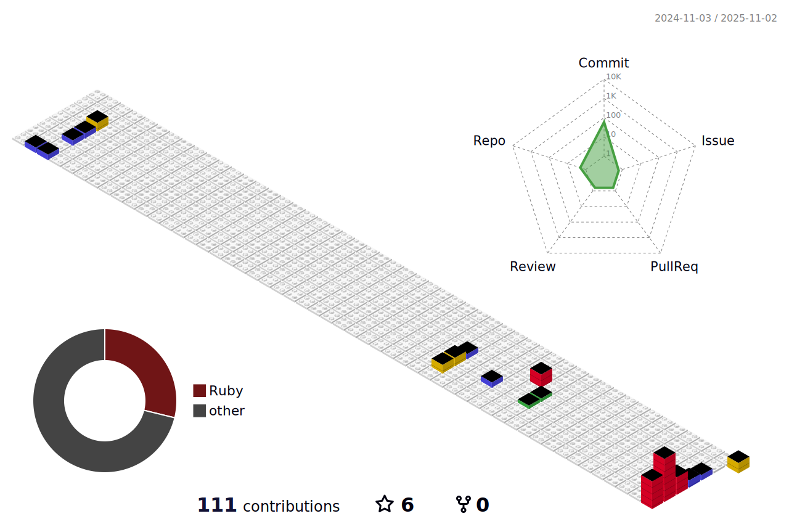

 <h3>안녕하세요.
   
  어려움은 있어도 안 되는 건 없다고 생각하며 개발하는
   
  프론트엔드 개발자 박창수 입니다.
 </h3>

 

 <h4>📚 STACKS</h4>
       
   
     
   
     
   
   
   
   
  <table>
    <tr>
      <td>
        
      </td>
      <td>
        
      </td>
    </tr>
  </table>

 

